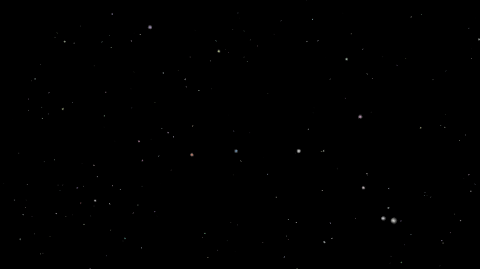

# abstrac
Streaming Abstract Pixel Art

## What is This Then ?
**Q:** The world's most overengineerd *Starfield* screen-saver??

**A:** I am not sure... there might be even worse.

There _might_ be a live broadcost on, right now, at https://www.twitch.tv/abstrac55

Other future content might be falling autumn leaves, "sliding doors", fun with typography etc...

## Goals
In the current embryonic state, almost all below is TODO, but...

What I am trying to achieve here, is to create nifty random algorithmic patterns... but not quite only that.
I want to create a structure where I create new abstract animations, and:
* **stream live animations** to Twitch, Vimeo, YouTube, etc
* easily review animations on my desktop, from debugger
* quickly tweak animation parameters
* easilt deploy the "animation streamer" to any server including cloud (e.g. `make deploy`)
* configure schedules and layers:
    * Multiple layers,
    * eg. overlay an animation with a blurred version of itself
* another aspect of configuration is to record a slightly longer loop, and stream that, to save CPU power, and the planet

## Credits & Dependencies

**The awesome `raylib`**  
License: zlib/libpng  
Copyright (c) 2014-2023 Ramon Santamaria (@raysan5)
https://github.com/raysan5/raylib
Version: 4.2.0

**The great `ffmpeg` toolset**  
License: GNU LGPL  
Copyright (c) 2000-2023 the FFmpeg developers  
http://ffmpeg.org  
Version: 5.1.2  
(Currently, only using the complete executable, later I might link directly)